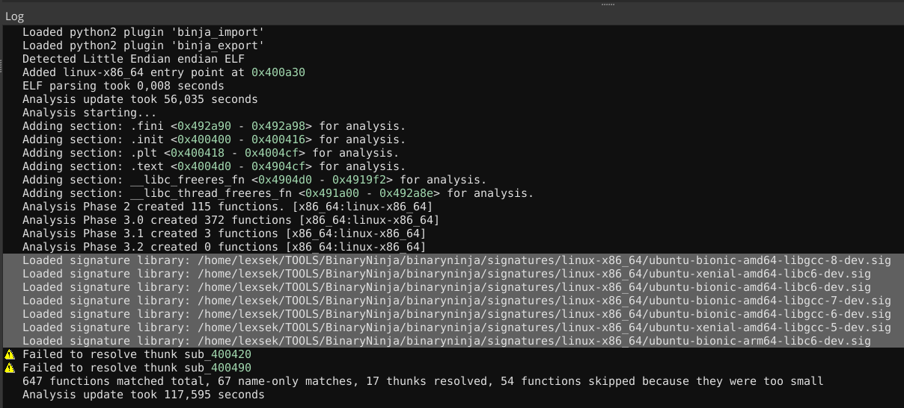
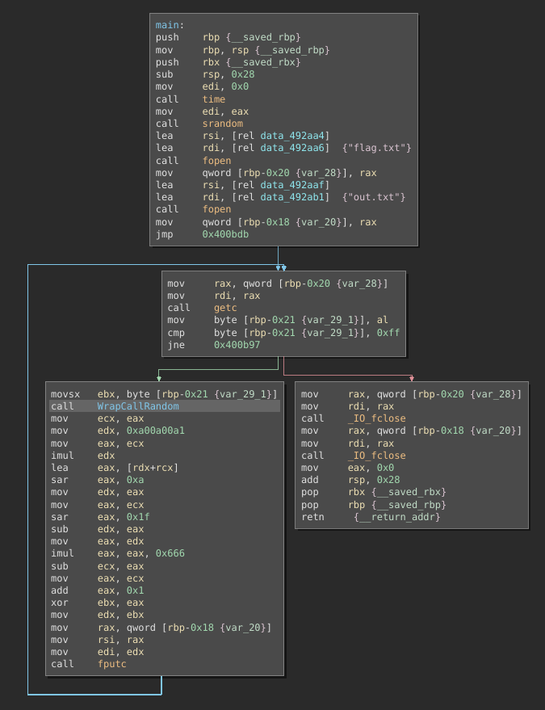
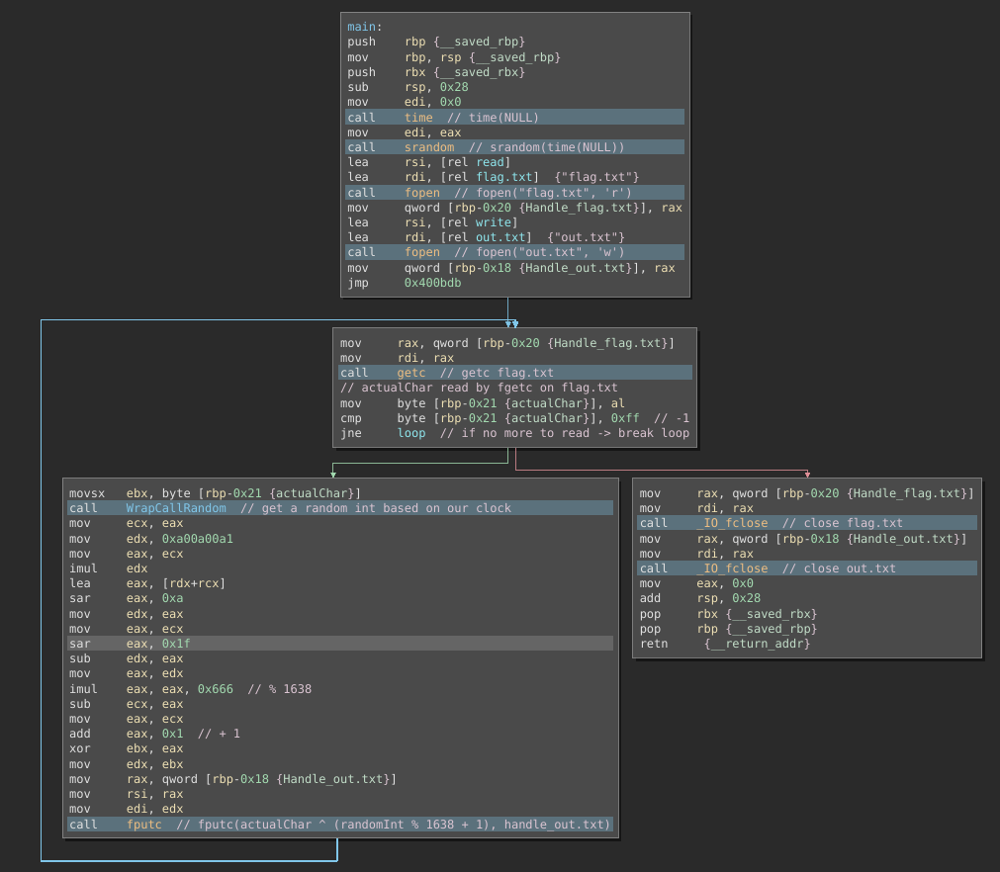

# Reverse-Engineering

## Informations

- CTF : Hexion CTF 2020
- Challenge Name : Nameless
- Challenge Authors : (Yarin & Idan)@HexionCTFTeam
- Challenge Description : Strip my statically linked clothes off
- Filename : nameless 
- Sha256   : 3d217a0300e96882af68e0382cd54ded7e2bff4824db5fa355bb78712b674a20 
- Filetype : ELF 64-bit LSB executable, x86-64, version 1 (GNU/Linux), statically linked, for GNU/Linux 3.2.0, BuildID[sha1]=323839c17d33008400842a9743c7813e8fcb646b, stripped
- Filename : out.txt
- Filetype : data
- Sha256 : 68d7d06638df361dd4c61e6b9f76f5245a8dbeaae7169ea2989f0306db40b283

## Analysis

### First look

The file nameless is an ELF 64-bit executable, that is statically linked, and stripped. That means that we won't have any informations about the function names like "fopen", and that we will have to rename and identify everything on our own.

There is another file, named out.txt that contains encrypted data, we can suppose that this file has been encrypted by the nameless file and that our objective is to reverse-engineer the encryption algorithm to decrypt it.

Here is the hexdump of the encrypted file :

```
00000000: 16ec 23c3 0601 b1f0 614a f481 3516 efaa  ..#.....aJ..5...
00000010: 5b3f 3851 620f 2113 64e7 67ee 417b 3ab9  [?8Qb.!.d.g.A{:.
00000020: ecb1                                     ..
```

Having a look into BinaryNinja in order to understand how the nameless executable works, you can see the following result in the log window:



BinaryNinja just analyzed the whole program and resolve symbols thanks to it's signatures database !

In the following graph of the main function we can see this chain of calls:
- time
- srandom
- fopen
- fopen
- loop
    - getc
    - random
    - fputc
- fclose
- fclose



### Program algorithm analysis

Ok, so after some renaming and some analysis, we ended up with the following comments about the algorithm:
- srand(time(NULL)) : Initialisation of the random number generator with the computer clock
- open flag.txt : File we have to recover
- open out.txt : We got that, it's the encrypted file
- loop : iterate over the flag.txt bytes
    - getc : get the actual byte from flag.txt
    - random : get a "random" int
    - encryption : actualByte ^ (random % 1638 + 1)
    - fputc : write the encrypted byte into out.txt file
- fclose : close flag.txt file
- fclose : close out.txt file



### Reversing the encryption algorithm

The xor operation is encrypting the flag.txt into our out.txt, and it is reversible.

Let's see how xor works :
```
a ^ b = c
a ^ c = b
a ^ 0 = a
a ^ a = 0
```

So in our case, we have :

```
outByte = (random % 1638 + 1) ^ flagByte
flagByte = (random % 1638 + 1) ^ outByte
```

The outBytes will be easy to recover because we do have the out.txt file, but for the random value we can ask ourselves :
> "How can we recover them as they are random ?"

Random value generators always have been a problem and a big question, here the program uses srandom and random, that have been initialized with time(NULL). It means that the seed is composed by the local clock (EPOCH Time that are the number of seconds that have elapsed since January 1, 1970 midnight UTC/GMT).

In order to decrypt the file, we have to find the seed at the time the program ran and encrypted the flag.txt file.

To achieve that we can bruteforce the timestamp from the time it has been compiled, and the start of the CTF.

```console
lexsek@lexsek:~$ exiftool nameless

ExifTool Version Number         : 11.85
File Name                       : nameless
Directory                       : .
File Size                       : 760 kB
File Modification Date/Time     : 2020:04:10 18:58:47+02:00
File Access Date/Time           : 2020:04:13 07:04:27+02:00
File Inode Change Date/Time     : 2020:04:13 07:04:25+02:00
File Permissions                : rw-r--r--
File Type                       : ELF executable
File Type Extension             : 
MIME Type                       : application/octet-stream
CPU Architecture                : 64 bit
CPU Byte Order                  : Little endian
Object File Type                : Executable file
CPU Type                        : AMD x86-64
```

Converting the File Modification timestamp to epoch, and the CTF start time on this website : https://www.epochconverter.com/

We obtain:
- 1586537927 : Compilation
- 1586635200 : Start of the CTF

Giving us (1586635200 - 1586537927) = 97273 possibilities.

### Decrypting the out.txt flag

Now that we know how to decrypt the file, we can make a C program that will decrypt out.txt, using the seed we give it as the argv[1] parameter, so we will wrap it with a bash script to iterate over the seeds and check if the flag.txt contains hexCTF flag.

```c
#include <time.h>
#include <stdio.h>

int main(int argc, char ** argv){

    if(argc != 2){
        puts("Usage: ./decrypt <seed>");
        return 1;
    }

    srandom(atoi(argv[1]));

    char encByte;
    int randNumber;
    FILE *flag = NULL;
    FILE *out = fopen("out.txt", "r");

    if (out == NULL){
        puts("Couldn't open out.txt");
        return 1;
    }
    
    for (flag = fopen("flag.txt", "w"); ; fputc((randNumber % 1638 + 1) ^ encByte, flag)){
        encByte = getc(out);
        if (encByte == -1){
            break;
        }
        randNumber = random();
    }

    fclose(flag);
    fclose(out);

    flag = NULL;
    out = NULL;

    return 0;
}
```

```bash
#!/bin/bash

for i in `seq 1586537927 1586635200`;
do
    ./decrypt $i
    ret=$(grep -ai hexCTF flag.txt)
    if [[ ! -z $ret ]] ; then
        echo "[+] Found flag :"
        cat flag.txt
        break
    fi
done
```

```console
lexsek@lexsek:~$ gcc decrypt.c -o decrypt
lexsek@lexsek:~$ chmod a+x decrypt.c decrypt.sh
lexsek@lexsek:~$ ./decrypt.sh
[+] Found flag :
hexCTF{nam3s_ar3_h4rd_t0_r3m3mb3r}
[+] Seed was :
1586541672
```

We finally got the flag.txt succesfully decrypted with the good seed waiting some seconds, that was pretty fast.

We know that the program was started on :
- GMT: Friday 10 April 2020 18:01:12 

### Conclusion

That was a really pleasuring challenge based on random number generator and xor, thanks again to the HexionCTF Staff & Challenger Makers for the fun !

Flag : hexCTF{nam3s_ar3_h4rd_t0_r3m3mb3r}