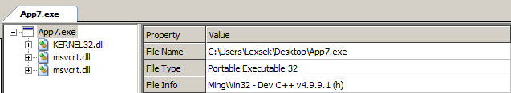
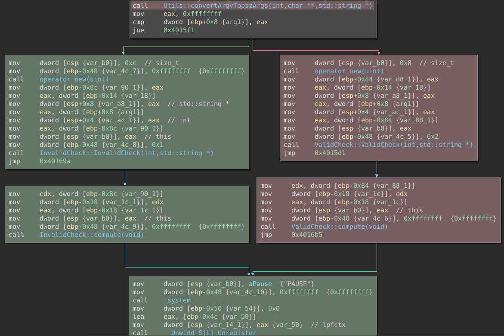
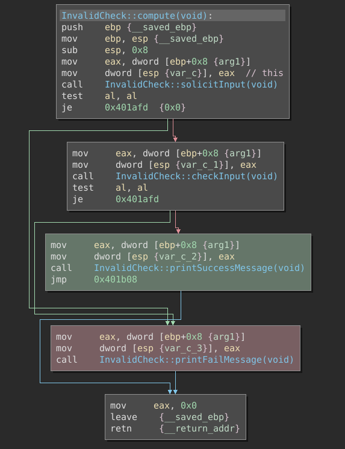
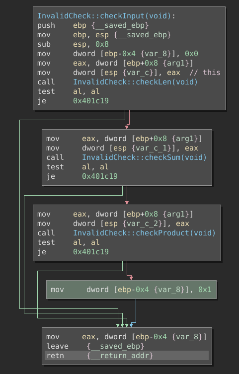
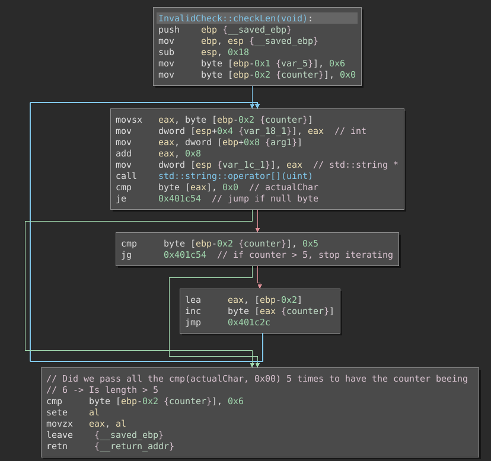
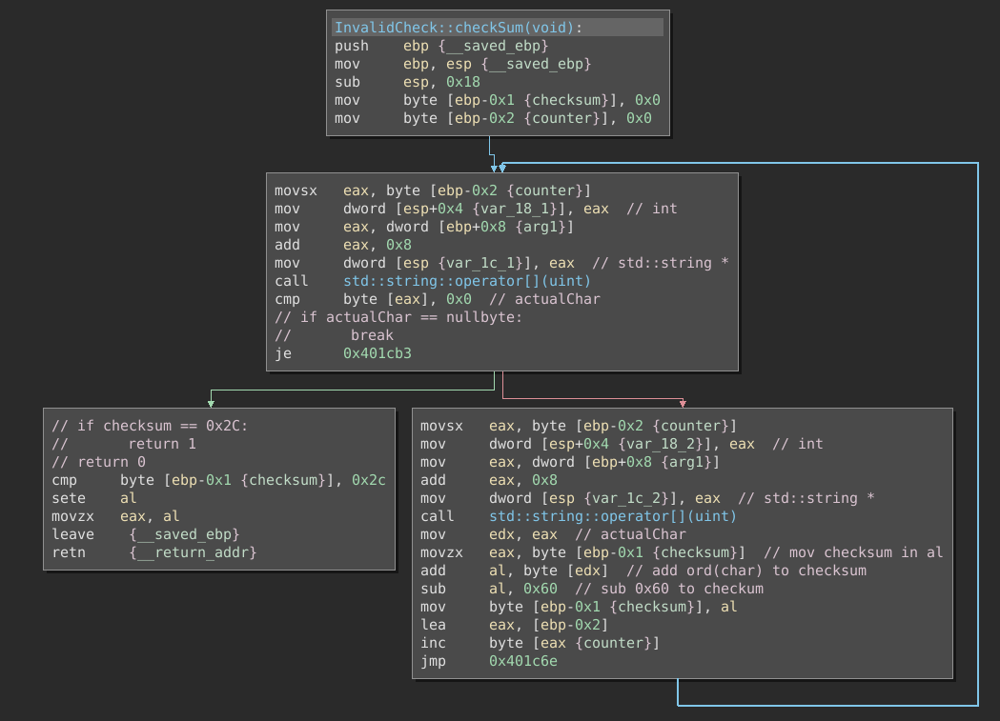
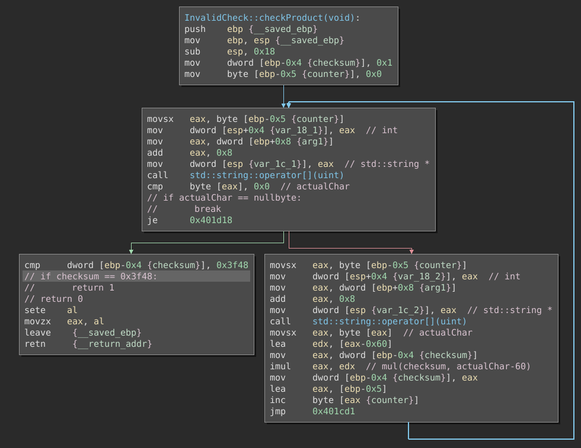
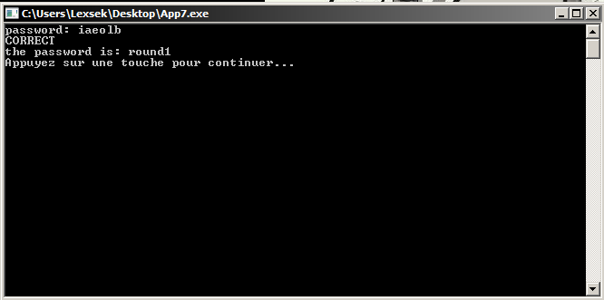

# Cracking

## Informations

- Website  : enigmagroup.org 
- Filename : App7.exe 
- Sha256   : b2cec5a9592d9b77c2359e2fedd9d87d13e663af54b5efd9555a13aa94913184 
- Filetype : PE32 executable (console) Intel 80386 (stripped to external PDB), for MS Windows 

## Analysis

### First look

The file App7.exe is a C++ cracking compiled with MingWin32 v4.9.9.1 as shown by CFF Explorer.



Having a look into binary ninja in order to understand how it works, we identify a function :
- Utils::convertArgvTopszArgs(int,char **,std::string *)

This function (higlighted in red) will simply calculate the number of arguments (argc), and it's return will be compared to -1, so the red higlighted block will never be called in our case.



If we focus on the green highlighted code, we can figure out some other functions :
- InvalidCheck::compute(void)
    - InvalidCheck::checkInput(void)
    - InvalidCheck::printSuccessMessage(void)
    - InvalidCheck::printFailMessage(void)



The thing we want is to get to the green highlighted block containing the "InvalidCheck::printFailMessage(void)" function, by having the return of "InvalidCheck::checkInput(void)" beeing 1.

Let's look at it's flow :
- InvalidCheck::checkLen(void)
- InvalidCheck::checkSum(void)
- InvalidCheck::checkProduct(void)



If all the conditions are met (return values of functions not beeing 0), we get to the green block setting the return value to 1, that will lead us to the Sucessfull printing function.

### Key verification algorithm

#### InvalidCheck::checkLen(void)

This function simply iterates on the password we entered in the console, and checks if the length is superior to 5.



#### InvalidCheck::checkSum(void)

This function iterates on the password characters we entered, and add each of their (ascii code - 0x60) to a checkum variable initialized to 0.

At the end of the function, the checksum must be equal to 0x2C, otherwise, we lose.



#### InvalidCheck::checkProduct(void)

This function iterates on the password characters we entered, and multiply each of their (ascii code - 0x60) to a checkum variable initialized to 1.

At the end of the function, the checksum must be equal to 0x3F48, otherwise, we lose.



### Solving the equation with z3

Putting all this together gives us the following equation :
- len(password) > 5
- all add(asciiCode - 0x60) == 0x2C
- all mul(asciicode - 0x60) == 0x3F48

We can achieve it using the z3 solver, here is the python code below

```python
from z3 import *

# Return a number of Int variables in a list
def initVars(name: str, counter: int) -> list:
    return [Int('%s%d' % (name, i)) for i in range(counter)]

# Add contraints to variables, only letters between 'a' and 'z'
def varConstraint(var, s):
    for v in var:
        s.add(v > 0x60)
        s.add(v < 0x7A)

# InvalidCheck::checkSum(void)
def checksumSum(var):
    checksumEqu = 0
    for v in var:
        checksumEqu += (v - 0x60)
    return checksumEqu

# InvalidCheck::checkProduct(void)
def checksumMul(var):
    checksumEqu = 1
    for v in var:
        checksumEqu *= (v - 0x60)
    return checksumEqu

# Format solution
def formatSolution(model):
    res = []
    for var in str(model)[1:-1].split(','):
        res.append(chr(int(var[var.find('=') + 2:])))
    print("password is : {}".format(''.join(res)))


s = Solver()                       # Create a solver

var = initVars('x', 6)             # Initialize 6 Int variables in a list
varConstraint(var, s)              # Add constraints to var (only lowcase letters)

s.add(checksumSum(var) == 0x2C)    # InvalidCheck::checkSum(void)
s.add(checksumMul(var) == 0x3F48)  # InvalidCheck::checkProduct(void)

if s.check() == sat:               # Check if equation is solvable
    print("Solved !")
    formatSolution(s.model())      # Format the solution
else:
    print("unsat")
```

```
Solved !
password is : iaeolb
```

### Conclusion

Executing the crackme and using the "iaeolb" password gives us the flag : "round1"

