# Cracking

## Informations

- Website  : reversing.kr 
- Filename : Easy_CrackMe.exe 
- Sha256   : 5ebd45b0d0ceaee67611357d6849836f6daad015467e2948f0ad27caa516a155 
- Filetype : PE32 executable (GUI) Intel 80386, for MS Windows 

## Analysis

### First look

The file Easy_CrackMe.exe is a Microsoft Visual C++ 6.0 PE32 executable cracking challenge as shown by CFF Explorer.

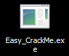
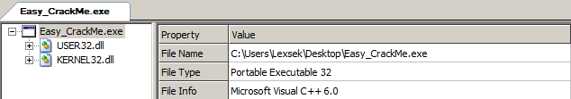

At launch, it asks for a password in a GUI.

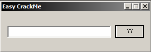

Having a look into binary ninja in order to understand how it works, we identify a function under the WinMain:
- DialogBoxParamA

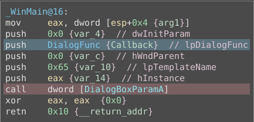

This function (higlighted in red) is kind of an event listener creator, associated to a trigger function (here highlighted in blue).

It will call the trigger function whenever an action is performed on the GUI, sending a message.

This message will determine which action to do for example by clicking on:
- x : Exit the application
- ?? : Call the function that is supposed to verify our input

Now let's have a look to this trigger function.

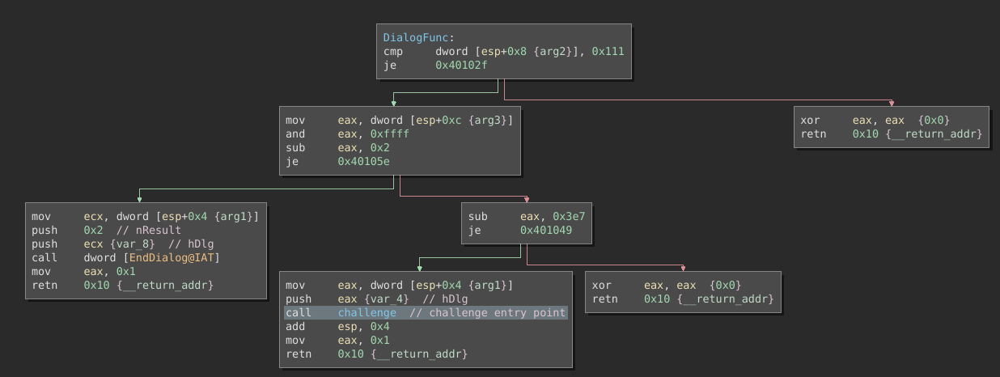

We can see some comparison with values like 0x2, 0x111, etc... these are constants:
- 0x111 : Check if it is a WM_COMMAND message
- 0x2 : WM_DESTROY message
- 0x3E7 : Our function linked to the ?? button

The function highlighted in blue will be called in we click on the "??" button, let's analyse it.

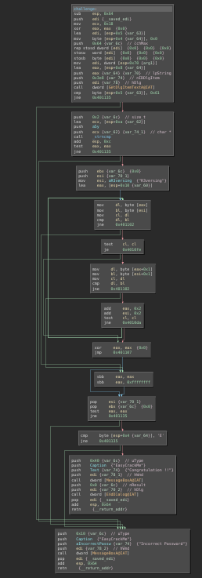

And now the graph after I analyzed the whole code:
- Red : Failure
- Green : Success / Compare
- Blue : Function calls / End loop checks

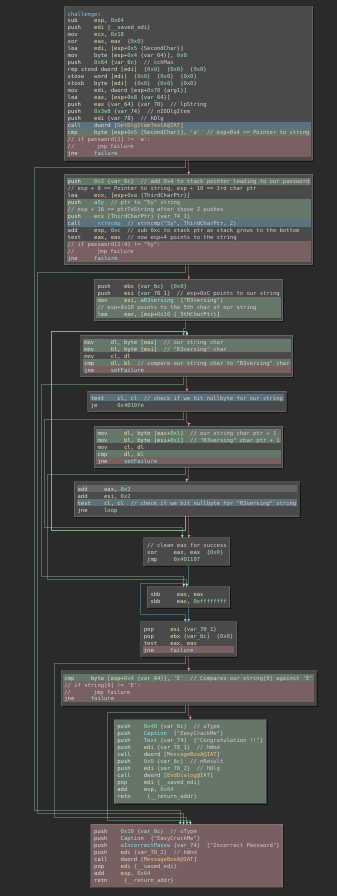

If all the conditions are met, we get to the green block printing "Congratulation !!", else we will go to the red block printing "Incorrect Password".

### Key verification algorithm

#### First verification

First of all, the program calls GetDlgItemTextA that will recover given the good ID the text entered in the input.

In our case it will recover the string we have written in the input.

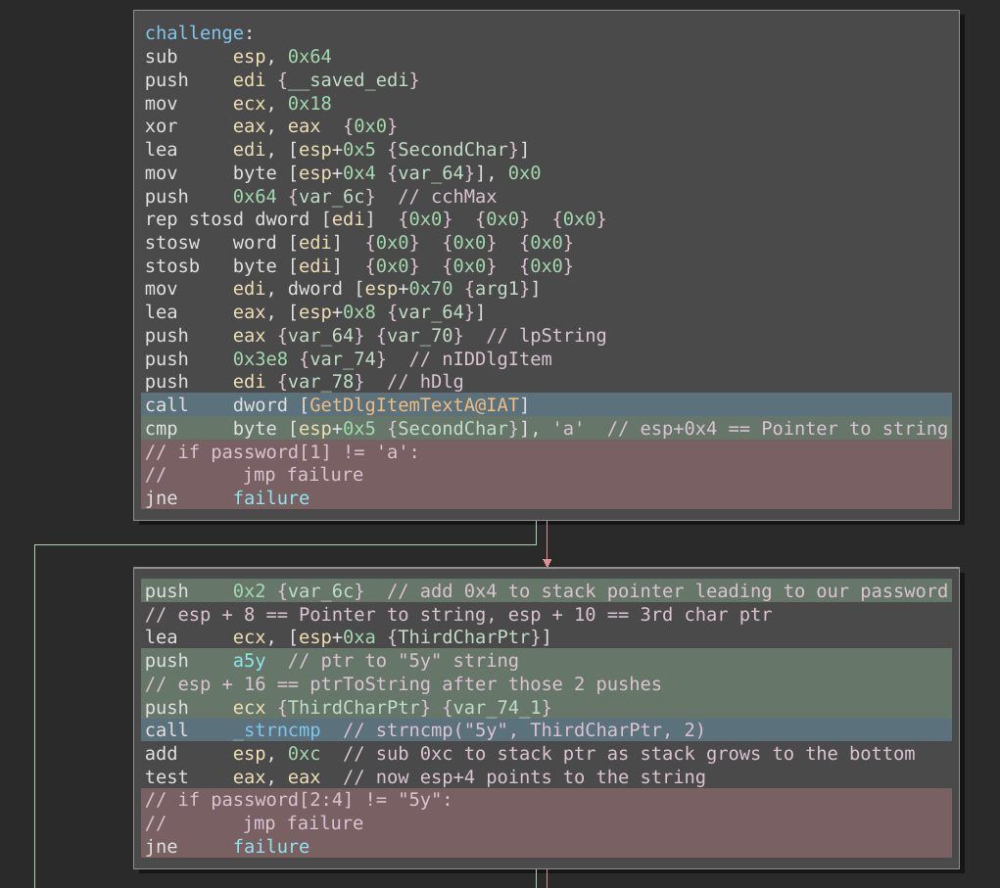

Our string pointer will be located in esp+0x4, so the comparison between 'a' and esp+0x5 will check for the second character of our string.

So far we know that our password must be like:
- ?a*

#### Second verification

The second verification is exactly on the same image, it an "strncmp()" function checking for the 3rd and the 4th character of our string to match "5y"

Password must be like:
- ?a5y*

#### Third verification

The third verification is a loop, iterating on the fifth character of our input until the end of it.

It should match "R3versing".

Actual password :
- ?a5yR3versing

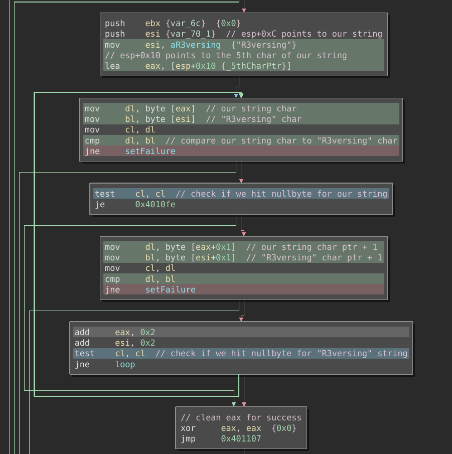

#### Fourth verification

The last one will be comparing the first character to 'E'.

If all those checks are passed, we get the "Congratulation !!", else we get the "Incorrect password" message box.

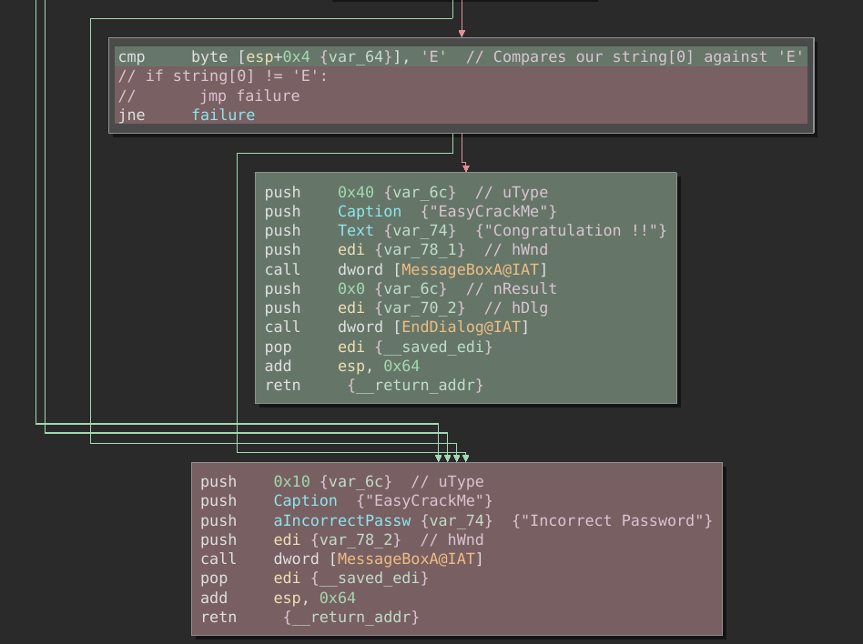

Actual password :
- Ea5yR3versing

### Conclusion

Executing the crackme and using the "Ea5yR3versing" will print the "Congratulation !!" message. 

Flag : "Ea5yR3versing"

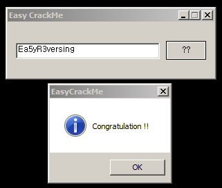