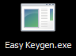
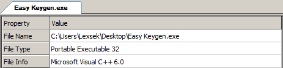
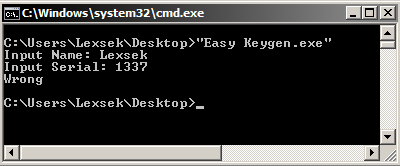
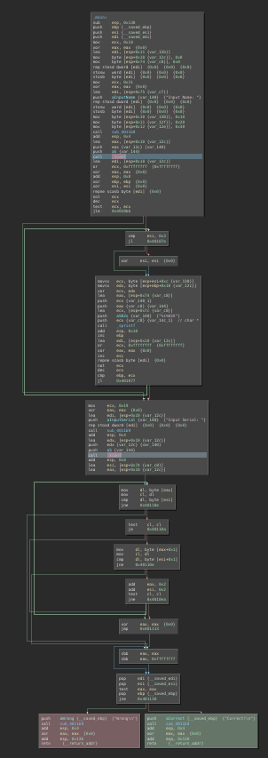
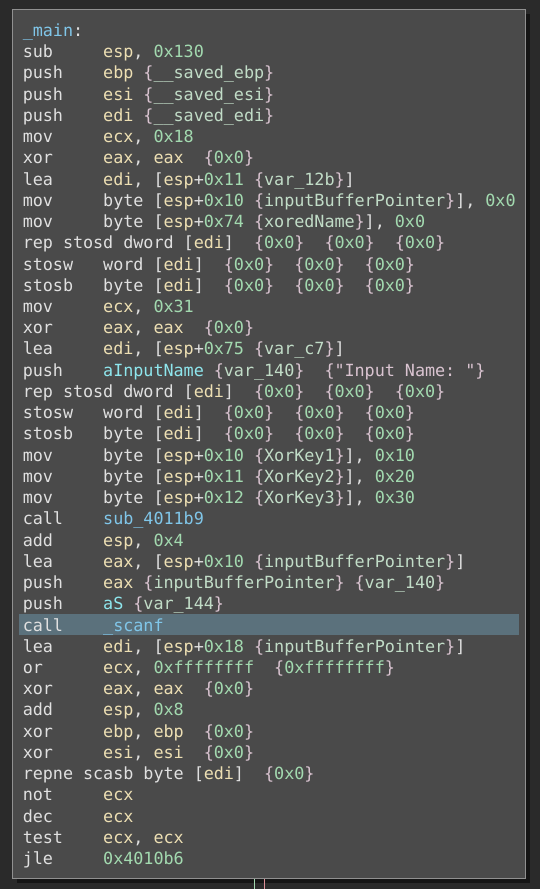
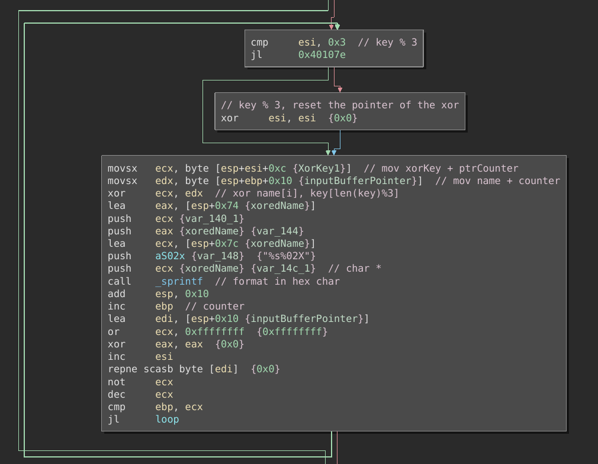
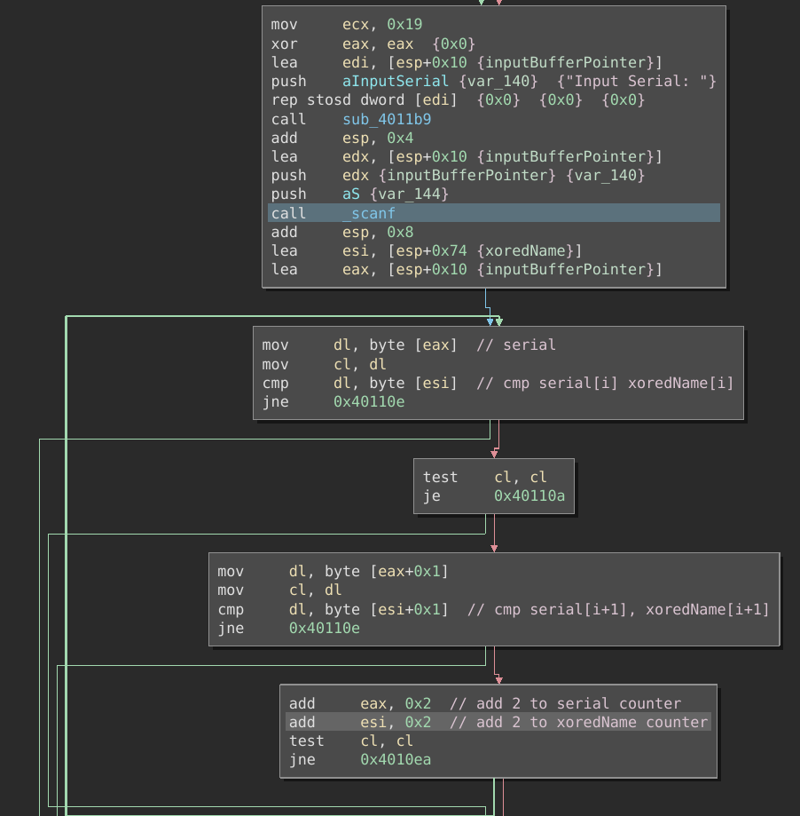
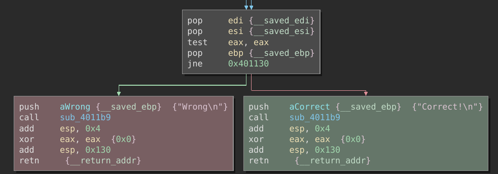
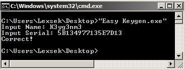

# Cracking

## Informations

- Website  : reversing.kr 
- Filename : Easy Keygen.exe 
- Sha256   : 55a7a873a069da50f98c966dcf2ba1c8b46e65a17e7913c2d6b8ab25e1402853 
- Filetype : PE32 executable (console) Intel 80386, for MS Windows

## Analysis

### First look

The file Easy Keygen.exe is a Microsoft Visual C++ 6.0 PE32 executable cracking challenge as shown by CFF Explorer.




A ReadMe.txt file is giving us some informations about our objective :


Usually, the serial in generated by an algorithm taking in input the name, here we will have to reverse-engineer the algorithm, and produce the opposite one in order to get the flag.

At launch, it asks for a password in our cmd.exe, and also a serial.



Having a look into binary ninja in order to understand how it works, you can see in the following graph of the main function :
- #1 scanf (highlighted in blue)
- #2 scanf (highlighted in blue)
- Failure (highlighted in red)
- Success (highlighted in green)



Between the two scanf, some operations are effectued on our input name, and after the second one, a loop is here to compare our serial with the result of the input after the opeation.

If all the conditions are met, we get to the green block printing "Correct!", else we will go to the red block printing "Wrong!".

### Key verification algorithm

#### Input name operation

Our input for the name will be put in the variable I renamed as "inputBufferPointer" after the scanf.

We can also see a xorkey that is moved on the stack "0x10 0x20 0x30".



Then, a loop will iterate over our name characters, and xor them with the key "\x10\x20\x30" and then format each character in uppercase hexadecimal.



For example, the character 'a' -> 97 in decimal value, xored with 0x10 results in 113 -> 0x71.
So our new value written in the formatted buffer will be '71'.

#### Check with the serial

The check with the serial consist of a loop, iterating over the xoredName in hexadecimal that we obtained from the previous step, and the serial we entered.



If they are the same, we get a "Correct!" message, else we get the "Wrong!" message.



### Keygen Development

Now that we know what is the serial generation algorithm, we can do the opposite and develop a python script to get the name corresponding to the requested serial "5B134977135E7D13".

Name to serial: 
- Input key
- Iterate over characters
- Xor with the key \x10\x20\x30
- Format as uppercase hexadecimal characters

Serial to name:
- Input serial
- Get characters two by two
- Iterate
- Xor with the key \x10\x20\x30
- Format as ascii character

Here is the python script to achieve both operations:

```python
def name2Serial(name: str) -> None:
    serial = []
    key = [0x10, 0x20, 0x30]
    for l in range(0, len(name)):
        serial.append(str(hex(ord(name[l]) ^ (key[l % 3]))).upper()[2:])
    print("> Serial : {}".format(''.join(serial)))

def serial2Name(serial: str) -> None:
    name = []
    key = [0x10, 0x20, 0x30]
    serial = [serial[i:i+2] for i in range(0, len(serial), 2)]
    for l in range(0, len(serial)):
        name.append(chr(int(serial[l], 16) ^ key[l % 3]))
    print("> Name : {}".format(''.join(name)))

choice = input("> 1: Generate Serial\n> 2: Generate Name\n")
if choice == "1":
    name = input("> Name\n")
    name2Serial(name)
else:
    serial = input("> Serial\n")
    serial2Name(serial)
```

```
python keygen.py
> 1: Generate Serial
> 2: Generate Name
2
> Serial
5B134977135E7D13
> Name : K3yg3nm3
```

### Conclusion

Executing the crackme and using "K3yg3nm3" as the name and 5B134977135E7D13 as the serial will give us the "Correct!" message.

Flag : "K3yg3nm3"

